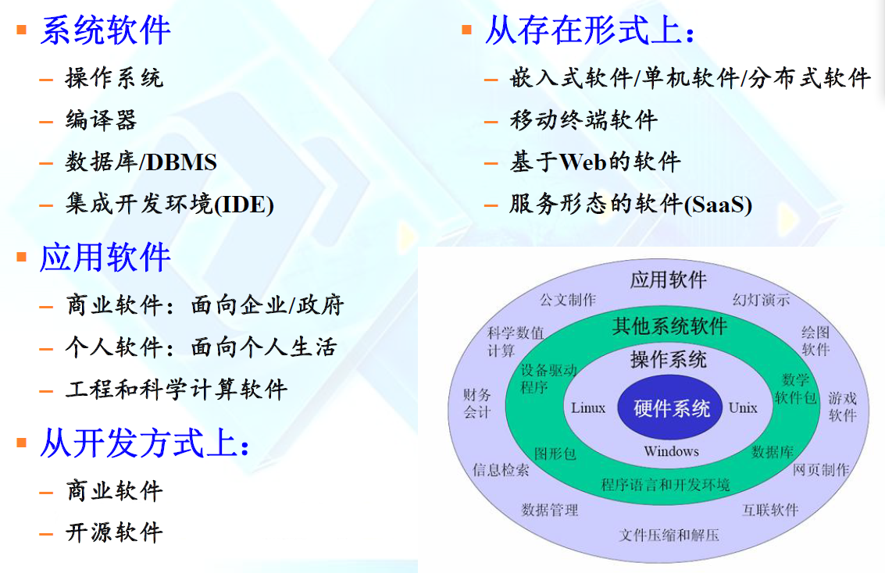
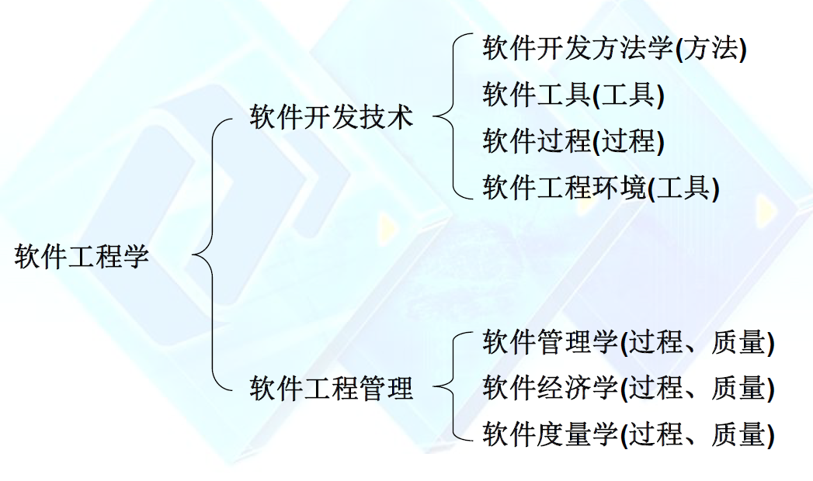

### 课程开设背景、意义和目的

#### 软件开发生命周期(SDLC)

##### RUP软件过程(统一软件开发过程)

1. 初始阶段、细化阶段、构造阶段、交付阶段

2. 核心工作流：商业建模  需求  分析与设计  实现  测试  部署

##### 敏捷开发(XP/Scrum)

1. planning   design   coding   test

2. 核心工作：TDD  、Sprint、  pair programming、continuous integration、 daily scrum meeting

***注***：1. 早年编码阶段：70-80  目前:20-30

​	2. **过程管理、项目管理、分析与设计**成为软件项目开发成功的关键内容

​	3. 工作量和时间占比最高的阶段是**分析与设计**

### 软件及软件工程

#### 软件的基本概念

##### 什么是软件

1. **软件** ：一组对象或项目所形成的一个"配置"，由*程序、文档和数据*等部分构成

   * 程序(program)：可被计算机硬件理解并执行的一组指令，提供期望的功能和性能

   * 数据(data structure)：程序能正常操纵信息的数据结构

   * 文档(document)：与程序开发、维护和使用有关的图文材料

     ***注***；程序不等于软件

2. 软件的四大特征

   * 复杂性(complexity)：软件无法以“制造”的方式被生产，只能采用手工开发方式(智力密集型)
   * 不可见性(invisibility)
   * 易变性(changeability)
   * 一致性(conformity)

3. 软件为何需要不断变化

   * 适应新的计算环境或新技术的发展
   * 实现新的业务需求
   * 扩展以与其他软件系统进行互操作
   * 不断的重构以使其生命周期得以延续

4. 软件的分类

   

##### 软件的发展

1. 第一阶段(50-60年代)
   * 主要用于数值计算
   * 质量完全依赖于程序员
   * 简单到复杂，导致 软件危机
2. 第二阶段(70年代)
   * 向商务领域推广，出现结构化编程、数据库等
   * 软件生命周期 概念出现
3. 第三阶段(80年代)
   * 出现 ***CASE工具***(Computer-Aided Software Engineering)
   * 开始关注软件的**质量度量和管理**
   * ***面向对象(OO)***思想出现
4. 第四阶段(90年代)
   * 出现**分布式、异构环境下的软件**
   * **软件复用**成为关注点
   * 软件生命周期每一阶段出现详尽的方法论
   * **分布式计算** 、网格技术
5. 第五阶段(2000年代-至今)
   * **敏捷软件开发方法**
   * 面向服务(SOA)

##### 软件开发方式的发展

1. 60-70年代:***结构化方法***

   * 好比建平房或用建平房的技术建造复杂建筑

2. 80年代：***面向对象***方法

   * 好比建高楼，可以更方便的构建复杂建筑
   * 对象=函数+数据      系统=对象+消息

3. 90年代：***构件化方法***

   * 好比堆积木、造预制件等，可以批量的、快速的构建更为复杂的建筑
   * 构件=对象+消息 or 构件=实体+接口
   * 系统=构件+连接件

4. 20年代：***面向服务的体系结构SOA方法->基于internet与云计算的软件开发方法***

   * **服务总线ESB**: 控制并切换<服务1(需求)>是调用构件A的服务1，还是构件B的服务1
   * 服务=构件的公共标准接口
   * 系统=服务+服务总线

   ***总结***：

   50-60：

   * 软件=程序
   * 面向过程的软件=算法+数据结构

   70：

   * 软件=程序+文档
   * 软件=程序+文档+数据

   80-90：

   * 面向对象的软件=对象+消息

   90-至今：

   * 面向构件的软件=构件+框架
   * 面向服务的软件=服务+消息+总线

#### 软件工程的基本概念
##### 软件工程产生的历史根源

##### 1. 没有银弹(人月神话)

1. 所有软件研发都包括了**本质复杂性(essential task)**和**偶然复杂性(accidental task)**
2. 软件研发中两大困难：
   * 软件本身在概念构件上具有先天的困难，即如何从抽象性问题发展出具体概念上的解决方案
   * 将概念构思施行于计算机上所遭遇到的困难

##### 2. 软件危机的产生导致软件工程的产生

1. 软件危机表现：成本与解读估算不准确、无法满足用户、质量不可靠、难以更改、没有标准文档、软件成本上升、开发生产率跟不上计算机应用迅速发展的趋势
2. 软件工程关注：软件开发方法  软件过程模型  软件项目管理 

##### 软件工程的基本概念

1. 软件工程重要不是技术，而是如何**开发软件项目的思想**
2. 软件工程是一种**建模、解决问题、知识获取、受软件工程原理指导**的活动
3. 软件工程范围：
   * 分析、设计、实现、测试、运行、维护
   * 软件开发中应遵循的原则和管理技术
   * 软件方法中所采用的技术和工具
4. 目标：
   * 满足用户需求
   * 按时交付
   * 控制成本
   * 高质量

##### 软件工程的知识体系

1. 软件开发方法学：面向对象  结构化
2. 软件工具与软件工程环境
   * 项目管理工具
   * 需求管理工具
   * 设计建模工具
   * 编程与调试工具
   * 测试与维护工具
3. ***软件质量特性***
   * 软件开发效率
   * 用户满意度
   * 可靠性
   * 可维护性
   
   Bug=软件行为和用户期望不一样

#### 软件工程工具

##### CASE工具(Computer Aided Software Engineering)

1. CASE工具->CASE工作台->CASE环境

### IaaS，PaaS，SaaS分别是什么，以及它们之间的关系

IaaS、PaaS 和 SaaS 是三种云计算服务模型，它们定义了云提供商与用户之间不同层次的服务和责任范围。

1. **IaaS (基础设施即服务)**：如前所述，IaaS 提供虚拟化的计算资源，用户可以租用服务器、存储空间等基础设施，并通过互联网管理和使用这些资源，而不需要投资于物理硬件。
2. **PaaS (平台即服务)**：提供除了底层基础设施外，还包括了开发环境，数据库管理系统，中间件等。这使得开发者可以更加专注于编写软件而无需管理OS、服务器和数据库。PaaS 为用户提供了一个平台，让他们可以在上面开发、测试、部署和管理应用程序。
3. **SaaS (软件即服务)**：是一种通过互联网交付应用程序的服务模式，用户不必安装和运行这些应用程序在他们自己的计算设备上，而是直接通过网页或API接口的方式使用软件服务。用户通常以订阅方式支付服务费用。

这三种服务模型之间的关系可以理解为一个堆栈结构，IaaS 是最底层的，提供基础设施；PaaS 是建立在IaaS之上的中间层，提供开发平台；SaaS 是位于顶层，直接对最终用户提供成品软件服务。

用一幢房子的比喻来说明它们之间的关系：

- **IaaS** 相当于提供了房子的基本结构，如地基、墙壁和屋顶。
- **PaaS** 提供了房子的内部结构，包含水电系统、窗户和门等，使得居住者可以装修自己的房间但不需操心建筑细节。
- **SaaS** 则相当于提供了一个完全装修好的房子或公寓，用户可以直接入住使用，不需要考虑房屋建设或维护的问题。