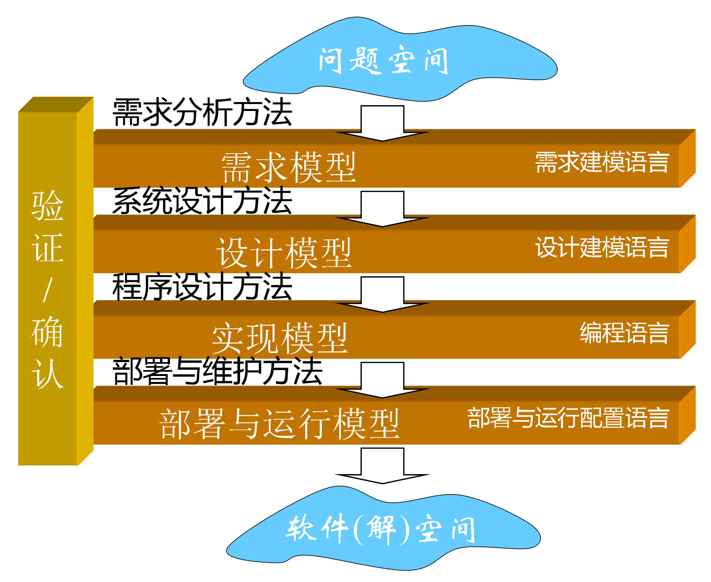
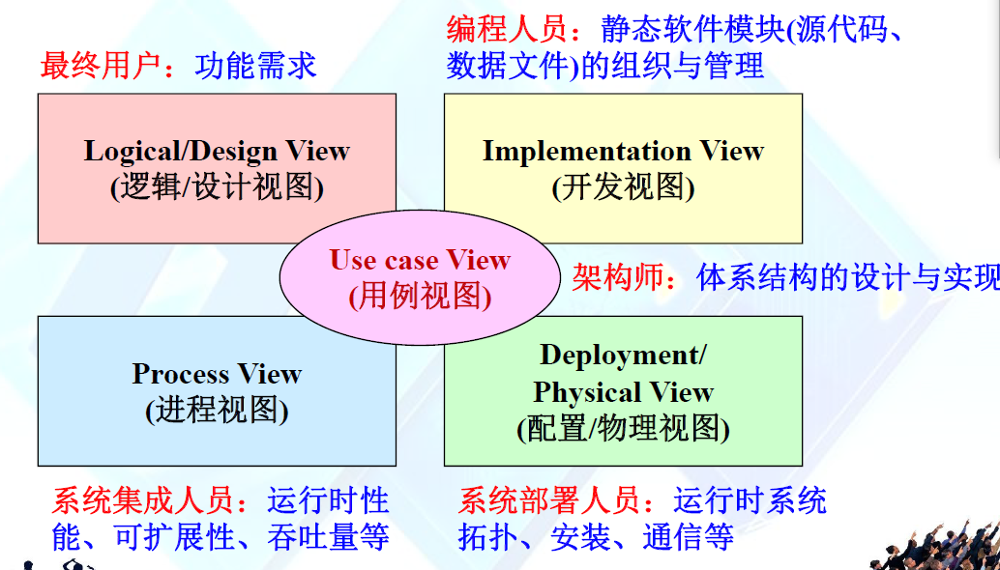

### 软件工程的本质：不同抽象层次之间的映射与转换

#### 软件系统开发的共同本质：***从现实空间的需求到计算机空间的软件代码之间的映射与转换***

1. 单步映射与多步映射
2. 软件工程本质：***用严格的规范和管理手段来缩小偏差，通过牺牲“时间”来提高“质量”***
3. 软件工程的两个映射
   * 概念映射：*问题空间的概念与解空间的模型概念之间的映射*
   * 业务逻辑映射：*问题空间的处理逻辑与解空间处理逻辑之间的映射*
4. 软件工程的作用：为了实现以上两个映射，需要解决：
   * 需要设置哪些抽象层次
   * 每一抽象层次的概念、术语与表达方式
   * 相邻两个抽象层次之间如何进行映射

序曲分析：现实空间的需求->需求规约

软件设计：需求规约->设计规约

实现：设计规约->代码

### 软件工程所关注的目标

软件工程具有***产品与过程二相性***的特点，必须把二者结合起来取考虑

##### 功能性需求：软件所实现的功能达到它的设计规范和满足用户需求的程度

1. 完备性
2. 正确性：描述软件在需求范围之内的行为
3. 健壮性：描述软件在需求范围之外的行为
4. 可靠性

##### 非功能性需求：系统能够完成所期望的工作的性能与质量

​	如：效率   **可用性**  **可维护性**   可移植性   清晰性   **安全性**   兼容性   经济性  商业质量

##### 不同类型的软件对质量目标的要求各有侧重

1. 实时系统：侧重于可靠性、效率
2. 生存周期较长的软件：侧重于可移植性、可维护性

### 软件开发中的多角色

### 软件工程 = 最佳实践

***大部分软件工程中的实践都没有理论基础***

***在自己开展实践之前，别人的任何经验都是概念***

### 软件工程的四个核心理论概念

1. 分治
   * 核心：如何的分解策略可以使软件更容易理解、开发和维护
2. 复用
   * 复用架构、框架  使用已有的软构件   复用功能模块
3. 折中
   * 空间与实践之间
   * 低成本与高可靠性之间
   * 安全性与速度之间
   * 核心：如何调和矛盾
4. 演化
   * 核心问题：设计软件初期需要考虑**可修改性、可维护性、可扩展性**