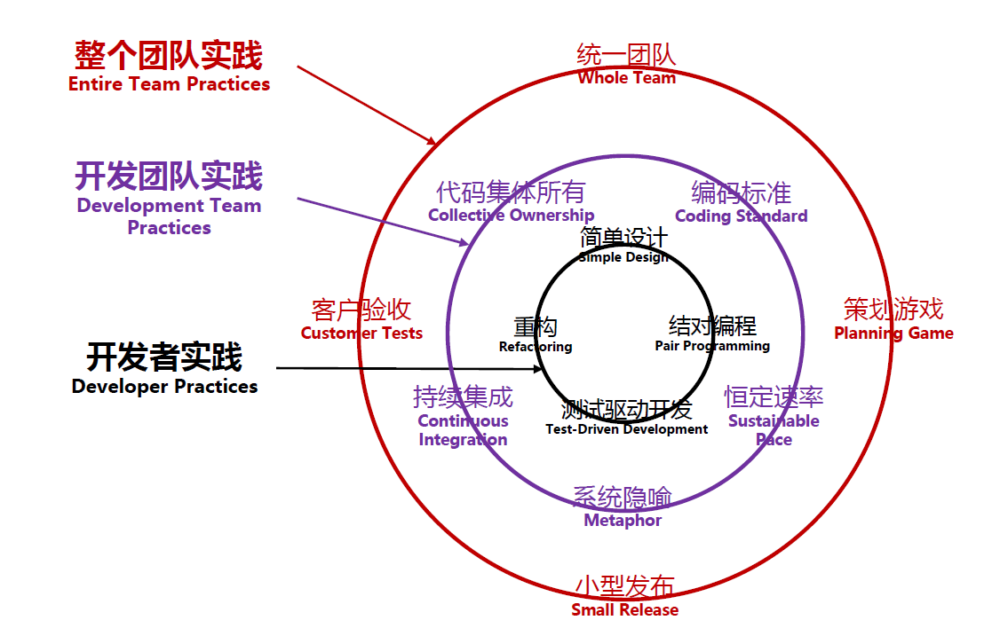
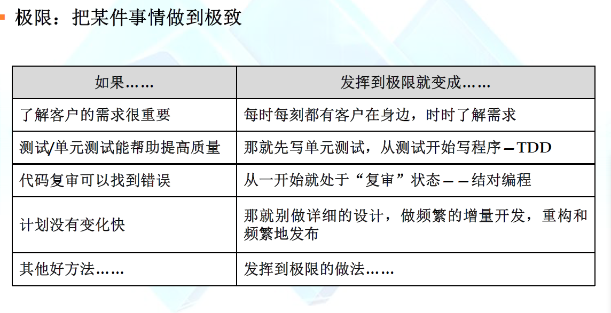
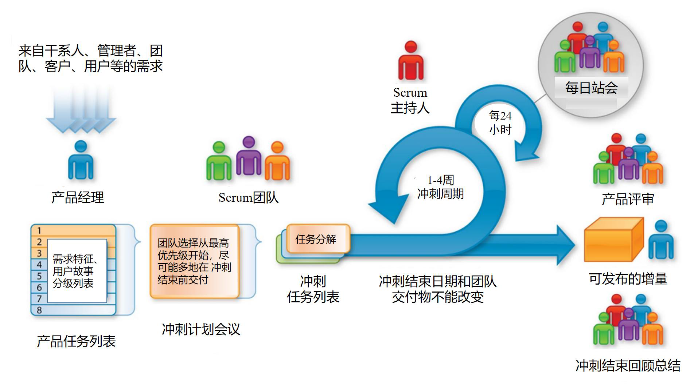
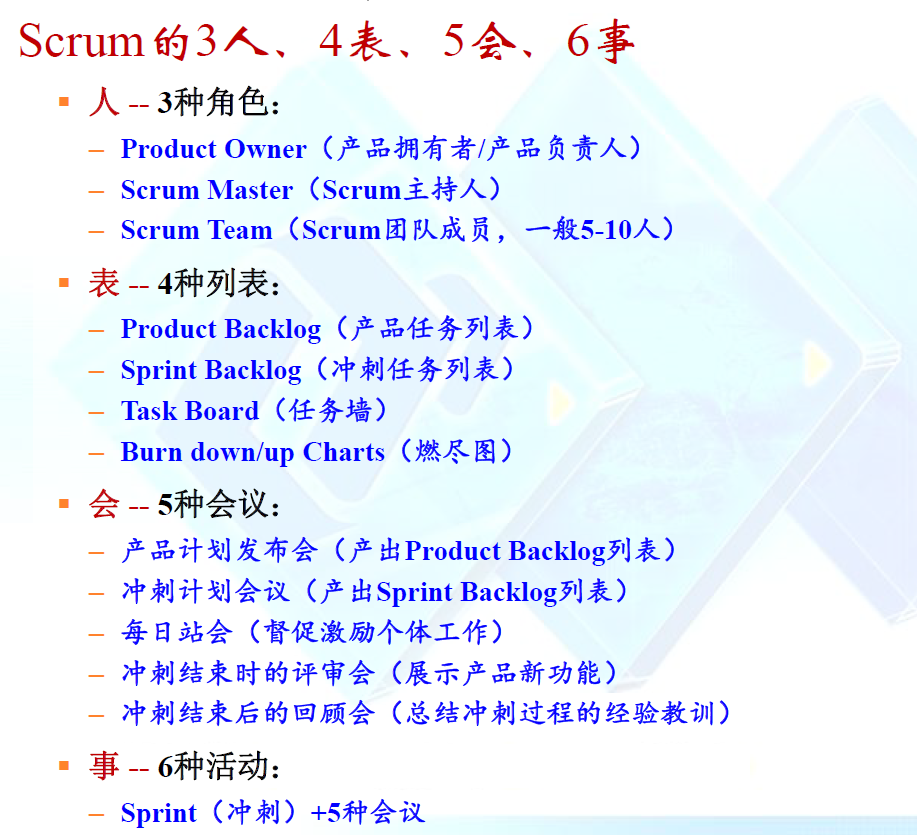
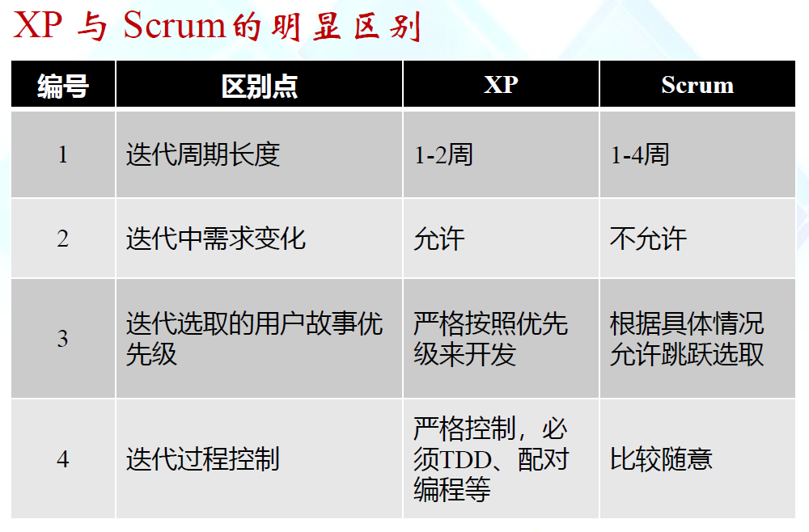
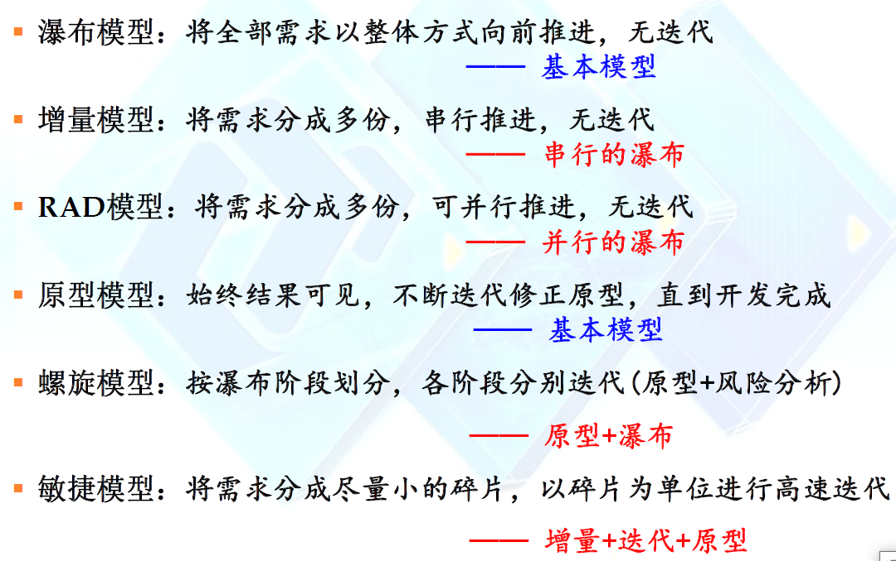
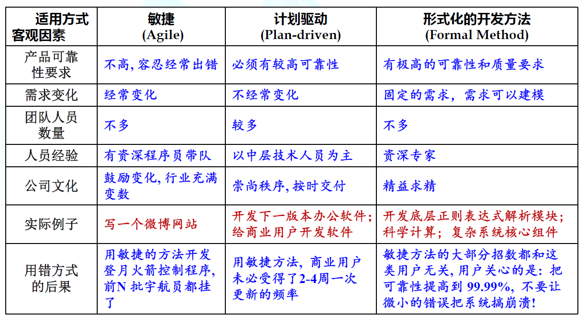

## 敏捷过程模型

归纳：***固定节奏，小步快跑，即使反馈，应对变化，快速交付***

#### 本质

***以快速的增量和迭代方式进行软件开发***

## 极限编程(XP)

产生于20世纪80年代后期

* 软件开发与软件需求的实践规则
* 二者有机融合，推进软件开发过程
* 包容需求的不断变化
* 底层开发人员高效的短期开发行为与项目宏观目标的一致性

##### 计划阶段：

* 形成用户故事
* 指定优先级
* 指定成本(开发周数)
* 将若干个用户故事指定未下一次发布的增量
* 规划整体进度

##### 设计阶段：

* KIS(keep it simple)原则
* 面向对象方法，CRC卡片
* 遇到困难，创建探针原型，也就是技术预研
* 对设计方案不断重构(改善内部结构，消除bug，提高效率，提高易读性)

##### 编码与测试阶段:

1. coding
   * 设计单元测试用例
   * 结对编程
   * 测试驱动的开发(TDD)
2. testing
   * 自动化单元测试
   * 持续集成
   * 持续回归测试
   * 验收测试

**结对编程**：轮换，只有水平上的差异    ***质量取决于各方面水平较高的那一位***

##### 关于XP的反对意见

* 需求波动
* 客户需求冲突
* 需求非正规表达
* 缺乏形式化设计

## Scrum

90年代初期出现，中期完善     一个Sprint建议长度是1-4周

① Product Owner组织会议将计划开发的产品分解成若干开发项（Product Backlog），该列表是有优先级的；该表中的开发项在没有被开发前是可以新增或删除的（引入需求变更）
② Product Backlog中的一个或几个任务项，是一次Scrum Sprint（Scrum冲刺）要开发的任务；1个Sprint一般为2-4周；一旦Sprint启动，在开发完成前是不允许变更需求的
③ 在Sprint开始前，Scrum Master组织Scrum Team会议将Sprint的任务分解为更小的开发单元（Sprint Tasks，列在Sprint Backlog）；Scrum Team成员的开发任务单元就是每个Task
④ Sprint启动后，每天需要召开一次会议（Daily Scrum Meeting），一般不超过15分钟，每人简短陈述3句话：上次Scrum例会后做了什么？遇到了什么问题？下次Scrum例会前计划做什么？（注意：提出的问题在例会上不做任何讨论）
⑤ Sprint结束后，展示产品新功能；并做Sprint评审和回顾，即Sprint Review Meeting和Sprint Retrospective Meeting
上述Sprint过程循环进行，直到Product Backlog列表空了为止

#### XP与Scrum的明显区别

## 与传统开发过程模型的对比

#### 一句话归纳各过程模型

#### 各过程模型比较

## 敏捷案例分析

