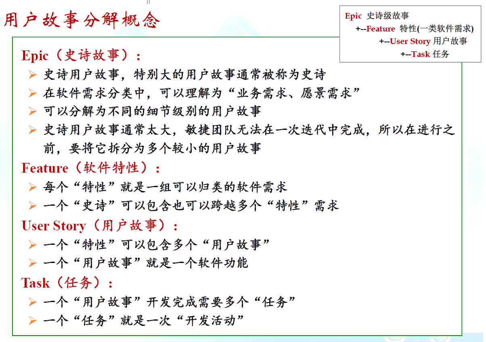
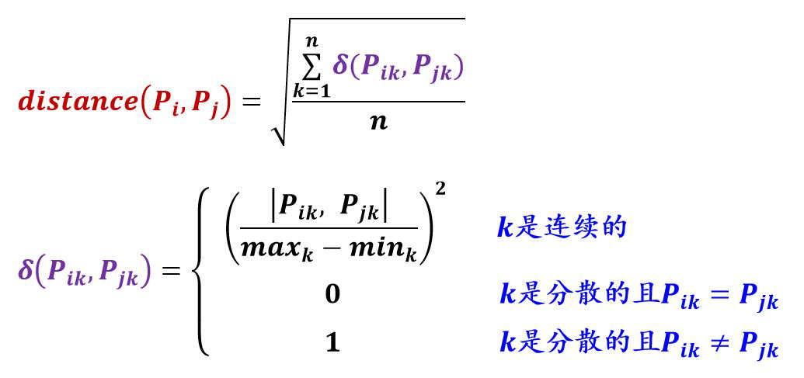
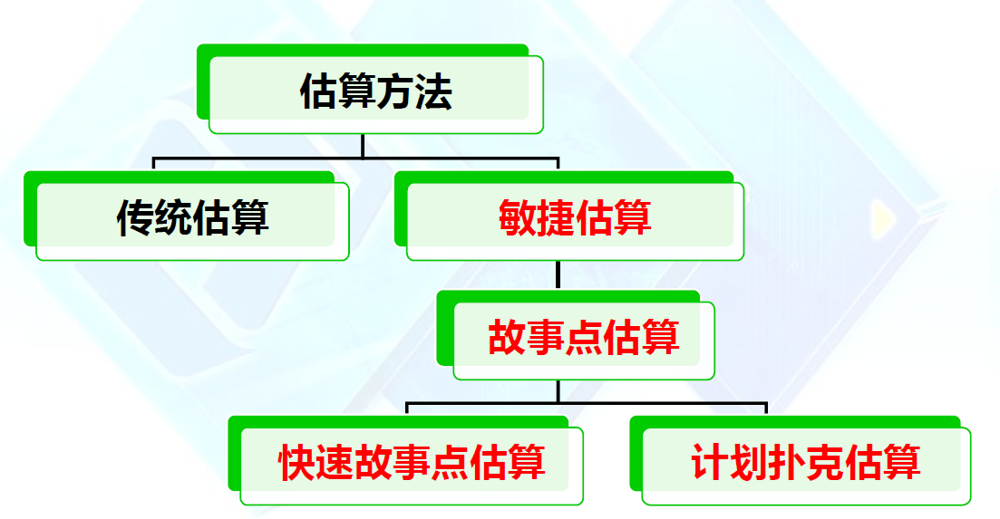
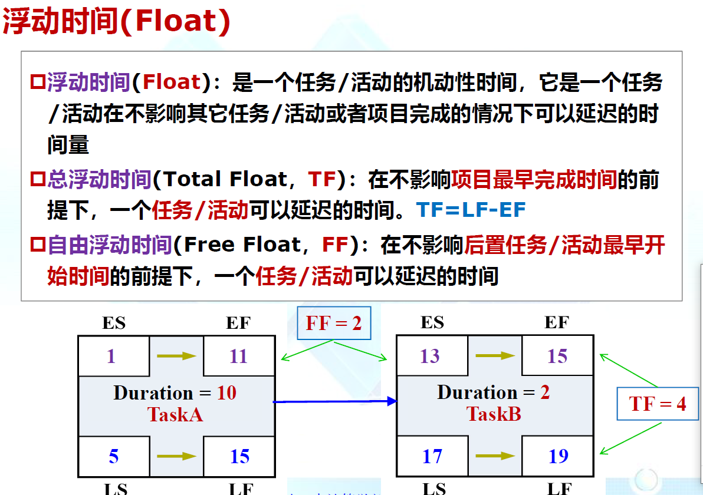
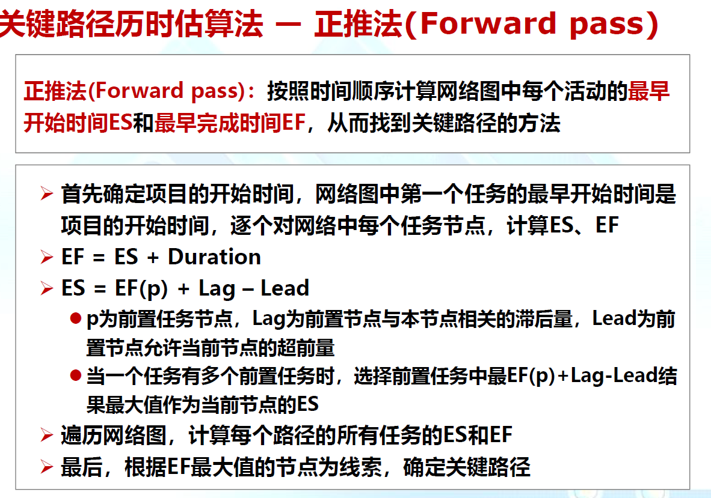
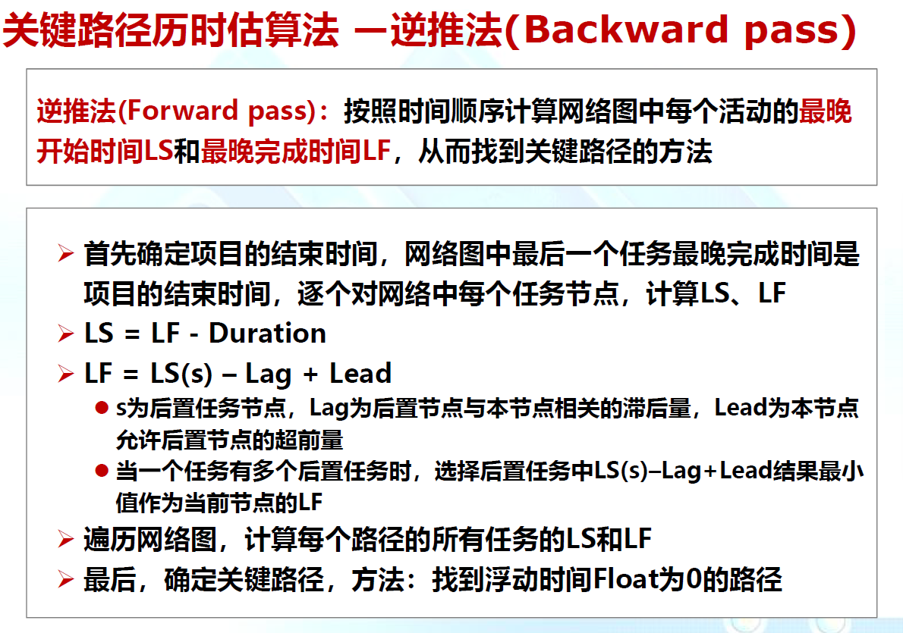
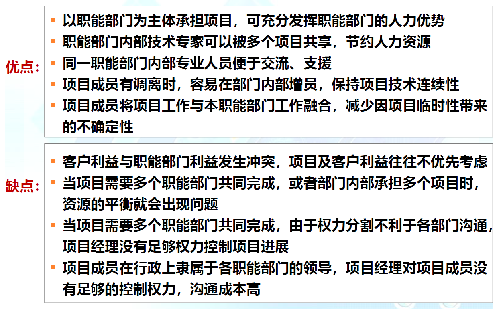
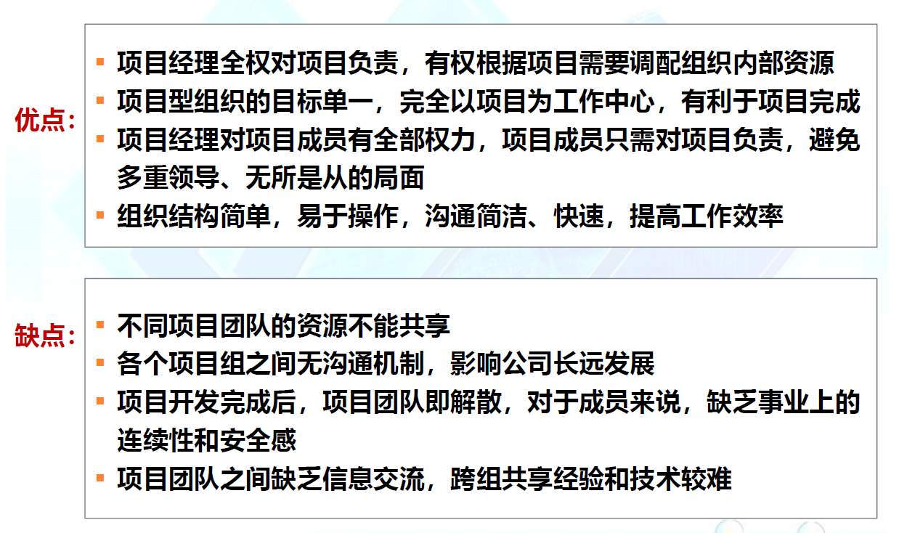
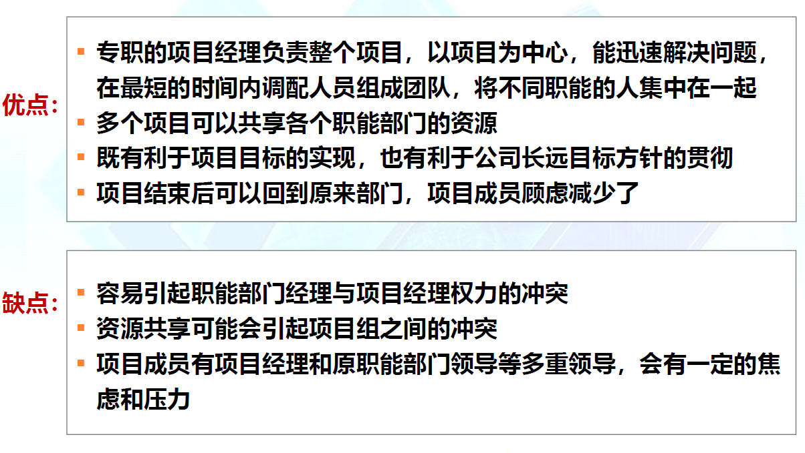

# 概述

***项目***：为创建某种特定产品或服务而组织或世纪的临时的一次性的行动，适用受约束的资源(资金、人、原料、能源、空间)来满足预定义的目标

***项目管理***：有效的组织与管理各类资源，以使项目能够在预定的范围、质量、时间和成本等约束条件下顺利交付

### 软件项目管理

对4p(人员、产品、过程、项目)进行分析和管理的活动

***根本目的***：让软件项目的整个软件生命周期都能在管理者的控制之下，以预定成本按期，按质完成软件交付用户

***挑战***：1. 在各类约束条件下交付项目   2. 通过优化资源的分配与基础来满足预先定义的目标

### 4P

过程：完成软件的方式，所有活动的框架

项目：完成软件要做的事情，管理复杂性、风险和变化

产品：应用软件制品，定义目标、范围和约束，考虑备选方案

### 产品

##### 软件产品、产品分解结构(PBS)

软件范围：

1. 功能和非功能
2. 软件范围应是确定的：在管理层和技术层都是无歧义的和可理解的

**PBS**：通过分层的树形结构来定义和组织项目范围内的所有产出物，自顶向下，逐级细分 

​    产出物：项目结束时需要提交的最终产品，在项目之初就可以准确预计

### 过程

1. 选合适的软件过程模型
2. 对模型进行适应性修改
3. 确定过程中应包含的工作任务列表

***工作结构分解(WBS)***：通过分层的树形结构来定义和组织工作任务之间的分解关系，自顶向下，逐级细分

### 项目

项目关注的四方面：**范围  时间  成本  质量**

***项目管理的主要任务***

1. 项目可行性分析与估算
2. 项目进度安排
3. 项目风险管理
4. 项目质量管理
5. 项目跟踪与控制

#### 可行性分析与估算

1. 需要多少工作量
2. 需要多少时间
3. 需要多少人员

还要预测资源以及风险

##### 确定范围

1. 与所有项目成员交流后，写出对软件范围的叙述性描述
2. 由最终用户给出一组用例

##### 可行性分析

1. 技术可行性
2. 经济可行性
3. 时间可行性
4. 资源可行性

##### 估算方法

1. 代码行估算法
2. 功能点
3. 用例点
4. 类比

***项目管理通常采用甘特图来描述任务的进度安排***

##### 资源、产出与里程碑

1. 资源(资金  人员  设备  环境)
2. 明确产出结果(每一项任务的产出结果是什么，对应于PBS中的哪一部分)
3. 明确里程碑(关键产出物，标志某一阶段的完成)

##### XP/Scrum敏捷开发中的进度计划与监控

任务墙/燃尽图

禅道(第一款国产的开源项目管理软件)  VersionOne(敏捷领域最流行化的商业化管理工具之一)

# 任务分解

***任务分解是项目管理的基础***

详细而正确定义软件项目开发的工作范围或边界，达到项目管理的基本粒度的任务集合

#### 工作包

1. WBS中最低层次的可交付绰，及叶子节点
2. 每个工作包由**唯一**主体负责
3. 项目管理的基本单位，成本估算、进度安排、跟踪控制等管理的最小对象

**WBS**:组织结构图   清单或分层目录形式

**WBS字典**：对每个任务的具体细节描述(任务标识号，任务名称，任务目标，任务描述，责任人)

##### 任务分解方法

1. 模板参照法：不同应用领域会有不同的任务分解标准，产生WBS模板
2. 类比法：复用已有类似项目的WBS进行项目的任务分解
3. 自顶向下法
   * 优点：符合人们解决问题的自然思维习惯
   * 缺点：对WBS开发人员要求较高，需要对项目重复了解
   * 适用项目：熟悉的业务领域项目，可以复用的项目
4. 自底向上法
   * 优点：可以集思广益，快速开展工作
   * 缺点：容易遗漏任务点，不够系统、全面
   * 适用项目：新业务领域，项目新增量，尤其适合敏捷方法

##### WBS任务分解粒度的掌控

工作包是可控和可管理的，但不必要过细

每个工作包必有一个提交物

有利于责任分配

推荐工作量在40以内

##### 敏捷项目的任务分解

# 成本估算

### 代码行估算法

1. 优点：搜友软件开发项目都有代码，而且容易计算代码行数
2. 缺点：
   * 对代码行没有标准定义
   * 代码行以依赖与个人编程风格
   * 项目早期难以估算代码量
   * 只是项目是现阶段的一部分，其他阶段无代码产出

### 功能点估算法

$FP=UFC*TCF$

FP：功能点

UFC：未调整的功能点计数

TCF：技术复杂度因子

***注：功能点不等于软件系统中可以运行的功能模块***

**UFC**：有EI  EO  EQ  ILF(内部逻辑文件)  EIF(外部接口文件)

$TCF=0.65+0.01*\sum_{i=1}^{14}F_i$

则项目工作量:$Effort=FP*PE$​   PE：项目开发生产率

### 用例点估算法

#### 未调整的用例点UUCP

#### 技术复杂度因子TCF

#### 环境复杂度因子ECF

$UUCP = UAW + UUCW$

$TCF=0.6+0.01*\sum_{i=1}^{13}TCFWeight_i*Value_i$

$ECF=1.4-0.03*\sum_{i=1}^{8}ECFWeight_i*Value_i$

$UCP = UUCP × TCF × ECF$

### 类比估算法

根据以往完成的类似项目所消耗的总成本(或工作量)，来推算将要开发的软件的总成本(工作量)

**注**:   适用情况：

* 有类似的历史项目
* 信息不足时
* 要求不是精确估算时

**注**：绝对值中是相减

### 自下而上估算法

利用WBS，对更高具体工作包进行详细的成本估算，然后将结果累加起来得出项目总成本

***特点***

1. 相对比较准确，它的准确度来源于每个任务的估算情况
2. 花费时间

### 三点估算法

基于任务成本的3种估算值(***最有可能成本、最乐观成本、最悲观成本***)来加权平均计算与其成本的方法

CM：Most possible Cost，最可能成本，比较现实的估算成本

CO：Optimistic Cost，最乐观成本，最好情况预期所得到的估
算成本

CP：Pessimistic Cost，最悲观成本，最差情况预期所得到的估
算成本

CE=f(CO,CM,CP)     CE即Expected Cost，预期成本，通过CO、CM、CP来计算

* 三角分布: CE = ( CO + CM + CP) / 3
* 贝塔分布: CE = ( CO + 4 CM + CP) / 6

### 专家估算法

由多个专拣进行估算，根据多个估算值得出最后的估算值

专家互不见面，每个专家给出β分布计算，最后计算平均值

#### 现代的敏捷估算思维

1. 采用轻量级估算方法快速生成高层级估算
2. 短期规划可以进行详细估算

### Story Point估算方法

#### 统一估算基准

1. 建立团队共同认可的估算基准值
2. 其他story以此基准值做对比来定义工作量或成本

##### 常用的两个标准

1. 斐波那契数列
   * 选0，1，2，3，5，8，13这七个等级
   * 若超过13，可以认为是Epic，可以再分解
2. $2^n$数列

#### 快速故事点估算(T-Shirt)

快速、粗略估算；过程有趣

#### 计划扑克估算

详细估算：可以设定相应规则

## 进度计划

时间是项目规划种灵活性最小的因素

进度安排是项目冲突的主要原因

### 历时估算

#### 定额估算法

$T=Q/(R*S)$

T：活动历时
Q：任务工作量
R：人力数量
S：工作效率(贡献率)

#### 经验导出模型

$D=a*E^b$

D：进度(以月单位)
E：工作量(以人月单位)
a：2-4之间
b：1/3左右：依赖于项目的自然属性

#### 关键路径法估计(CPM)

类比估算

#### 专家判断

1. 进度计划
2. 有关估算经验
3. 学科或应用知识

#### 基于承诺的估计

开发者做出进度承诺

##### 进度制订的主要工具：甘特图  里程碑计划   网络图

## 团队计划

#### 开发团队组织方式

1. 一窝蜂模式：没有明确分工
2. 主治医师模式
   * 首席程序员：处理主要模块设计与编码
   * 其他人支持他的工作
   * 可能变成一个人做，其他人打酱油
3. 明星模式
4. 社区模式
   * 志愿者参与，参与自己感兴趣的项目
   * 众人拾柴火焰高，但都烤火或柴火质量不高就不行
   * 社区不意味着随意，成功的社区由严格的代码复审和签入的质量控制
5. 交响乐团模式
   * 人多，各司其职，严格遵循纪律
   * 靠指挥协调
   * 多次练习过的曲目，重在执行
   * 类似于工厂，遵循预定的生产流程，规格严格
6. 爵士乐模式
   * 没有谱子于指挥，即兴发挥
   * 主乐手吹出主题，其余人即兴发挥，主乐手最后加入来回应主题
   * 类似于天才构成的敏捷团队，功夫到家，率性而为
7. 功能团队模式
   * 不同能力的同事写作开发
   * 项目完成后，这些人会重新组织
8. 官僚模式
   * 组织种由领导于被领导关系，跨组织的合作比较困难

#### 组织结构的主要类型

##### 职能型

##### 项目型

##### 矩阵型

开发团队确定后，需要制订人员职责计划：

责任分配矩阵，组织分解结构，文本描述

##### 责任分配矩阵(RAM)

1. 明确角色与职责

2. 避免责权不清

##### 组织结构图(OBS)

1. 展示团队成员及其隶属组织关系，请示报告关系
2. 与WBS建立关联关系，构成责任矩阵

##### 文本描述

详细定义项目小组及项目成员的职责

敏捷方法提倡高度透明